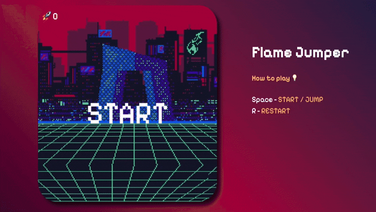

## Flame Jumper



**Game Description:**

Welcome to a thrilling browser game, you control a brave person, trying to escape the apocalypse.

Your mission is to flee from the end of the world by jumping over fiery meteors that fall from the sky like the wrath of heaven itself and collect points. Each jump is a step towards salvation, each obstacle a test of your agility and reaction.

**🎮 Game Features:**
- **Unique Design:** Inspired by the famous dino from Google Chrome's offline mode, but with a new, apocalyptic twist.
- **Dynamic Obstacles:** Small, wide, tall and double meteors unlock as your score grows.
- **Smooth Difficulty:** The world speeds up with every point, and the scenery changes as you reach new milestones.
- **Survival Challenge:** How long can you last in this blazing world?

**🛠 Technologies:**
- **HTML5**
- **CSS3**
- **JavaScript (ES modules)**
- **Canvas API**
- **Web Audio API** for synthesized sound effects
- **Vite** for dev server and build, **Vitest** for tests, **ESLint** for linting

**🚀 Functionality:**

- ✅ Endless runner with frame-rate independent physics
- ✅ Variable jump height: tap for a short hop, hold for a high jump
- ✅ Four obstacle types with fair hitboxes
- ✅ Four visual levels with crossfade backgrounds
- ✅ Three playable characters
- ✅ Pause, including automatic pause when the tab is hidden
- ✅ Best score and recent runs saved in localStorage
- ✅ Sound effects with mute toggle
- ✅ Works on touch devices: the canvas scales to the screen and every action is a tap

**🕹️ Controls:**
- **Space / ↑ / Tap** - jump (hold for a higher jump)
- **Enter** - start / restart
- **↑ ↓** - choose a character, **Esc** - back
- **Esc / P** - pause
- **M** - mute sound
- **S** - stats, **C** - change character (on the game over screen)

**💻 Development:**

```bash
npm install
npm run dev      # dev server
npm test         # unit tests
npm run lint     # eslint
npm run build    # production build in dist/
npm run deploy   # publish to GitHub Pages
```

Play to find out how far you can run from the flames of doomsday. Courage, reflexes, and a bit of luck are what you need for salvation!

*Let's start this fiery adventure!*

---

## 📜 Author

👨‍💻 **Developer:** Dimitri Jmukhadze
📩 **Contact:** [email@example.com](mailto:jmukhadze.dimitri@gmail.com)
🚀 **Portfolio:** [DJprojects](https://practicum-react-portfolio.netlify.app)
